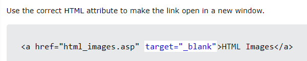
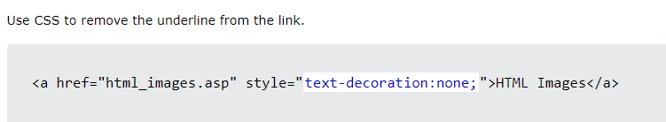
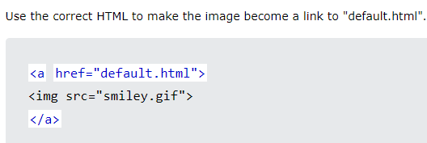
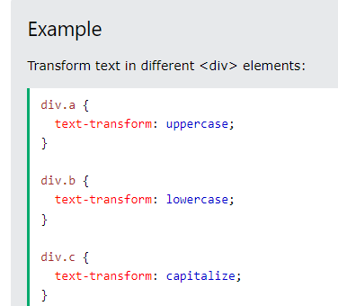
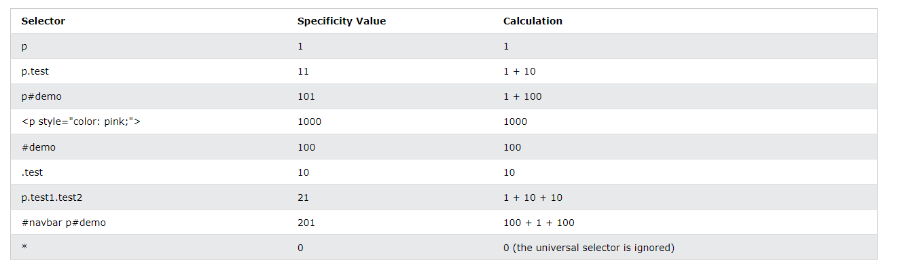

# new note

```html
<!-- わたしわPhongですです

 -->
```


ctrl x : delete a row
alt + shift + f : format code
bôi đen -> alt w để chuyển thành paragraph
alt + up/down để dịch chuyển (list)
ctrl + alt + v : paste words+image mix trong .md
ctrl +shift +v :preview markdown
add new target blank : 

remove underline link: 

link image and link: 

upper/lowercase: 

```css
h1 {

    color: red;

    font-family: Arial, Helvetica, sans-serif;

    font-size: 26px;

    line-height: 30px;

    font-style: italic;

    font-weight: bold;

    text-align: center;
```
div>p : p con trực tiếp của div
div p: tất cả các p trong div, ngay cả p là cháu của div
độ ưu tiên
  

bôi đen -> control D để multi code
bôi đen -> F12 để search thông tin style trong css
trong class có thể đặt nhiều tên cách nhau bởi dấu ' '
độ ưu tiên của heading cao hơn body
trước khi set border box, thì set  *{set margin với padding là 0}


.tên_class sẽ ra thẻ div chứa class
.tên_class*3 sẽ ra 3 thẻ div

shift + alt + up/down : copy dòng và paste up hoặc down
-> Nhớ : justify content : main axis, align items : cross axis


**align-items** 


**align-content:**


**justify-content:**


**flex-direction** 

row: 
row-reverse:
column:
column-reverse: 
test: https://flexboxfroggy.com/#vi

display: grid-inline : bọc chữ


grid span:


grid no span:


grid-area


Week2
Day 2 
hàm calc(a/b), nếu khác đơn vị vẫn tính được, sẽ quy về 1 đơn vị
#808080: --gray -300
#969696: --gray -200
#d0d0d1: --gray -100
#161617: --black -300
#1f2022: --black-200
#2d2d2f: --black -100

#4573fd: --blue
#fff: --white

h1 heading-primary
		ff:  Sora
		fs: 66px
		fw: 700
		light-height: calc(76/66)
h2 heading-secondary
		ff: Sora
		fs: 48px
		fw: 600
		lh: 58/48
p  subheading-secondary
		ff: Popping
		fs:10px
		fw: 500
		lh: 1
		color: var(-green)
p.text
	ff: Poppings
	fs: 16px
	fw: 400
	lh: 26/16
	color: var(--gray-200)

4px: --border-radius-xs
8px: -sm
14px: -md
20px: -lg

sử dụng Alt kéo thả để đo kích thước trong figma
container
	max-width: 1206
----------------
Google font: nơi lưu trữ font 

margin-left : -15px
margin-right: -15px

a, a:hover, a:active, a:visited, a:focus {
    text-decoration:none;
}

mặc định của align-items : stretch, của justify-content : flex-start
---------------------
cách tạo nhanh: 
ul.navbar-nav>li.navbar*3